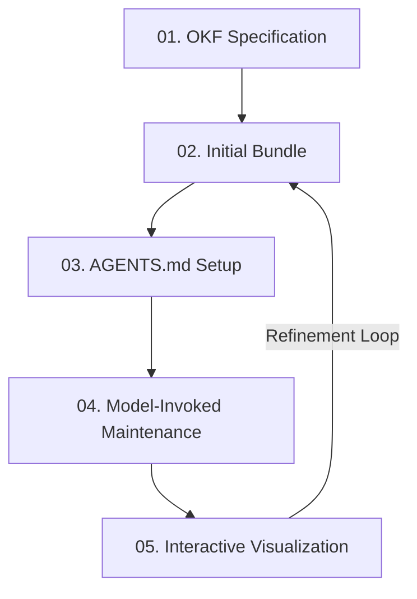

# The Self-Documenting Codebase (OKF Skills)

> **Live Interactive Visualizer & Token Simulator:** [👉 Visit the Interactive OKF Playbook & Simulator](https://eloybar.github.io/okf-skills/)

Integrating Open Knowledge Format (OKF) specifications with LLM skills constructs an adaptable, zero-rot knowledge ecosystem for brownfield and greenfield repositories. 

---

## 🔄 The Knowledge Loop Lifecycle

The self-documenting codebase runs on a closed-loop system of continuous concept mapping, steering, and verification:



### 1. OKF Specification
Establishes typed Markdown concepts to store codebase architecture, core domain models, and solutions.
* **Component**: [okf/SKILL.md](file:///D:/projects/okf-skills/okf/SKILL.md)

### 2. Initial Bundle Creation
Builds the first set of concepts under `./okf` or `./docs/solutions` to document the codebase's architecture and lessons learned.
* **Component**: [okf/SKILL.md](file:///D:/projects/okf-skills/okf/SKILL.md)

### 3. AGENTS.md Steering Notice
Informs incoming LLM agents (like Antigravity or Claude Code) that the repository has a structured knowledge base, providing instructions on how to use it.
* **Component**: `AGENTS.md` (root directory configuration)

### 4. Model-Invoked Maintenance
Automatically runs post-edit checks to verify that modifications to files don't render documentation out of date. 
* **Component**: [okf-maintain/SKILL.md](file:///D:/projects/okf-skills/okf-maintain/SKILL.md)

### 5. Interactive Visualization
Generates dynamic Cytoscape.js HTML graph visualizations of concepts, dependencies, and connections.
* **Component**: [okf-visualize/SKILL.md](file:///D:/projects/okf-skills/okf-visualize/SKILL.md)

---

## ⚡ Why This Approach is Effective

* **Eliminating the "Cold Start":** When a new developer or agent joins a project, they do not need to spend hours manually reading files to construct a mental model.
* **Adaptive Context Scaling:** Rather than providing a raw dump of files, agents ingest only the relevant concept bundles.
* **Zero Documentation Rot:** By hooking into the agent's edit lifecycle, concepts are kept fresh with every commit.

---

## 📥 Installation

You can install these skills to your local coding agent using any of the following methods:

### Method 1: Using the `skills` CLI (Recommended)
If your agent supports the `npx skills` installation tool, you can install all skills in this repository with a single command:
```bash
npx skills add eloybar/okf-skills
```


### Method 2: Windows (PowerShell)
To clone and install all skills along with their assets/subfolders:
```powershell
git clone https://github.com/eloybar/okf-skills.git
New-Item -ItemType Directory -Force -Path "$HOME\.claude\skills"
Copy-Item -Path "okf-skills\okf", "okf-skills\okf-maintain", "okf-skills\okf-visualize" -Destination "$HOME\.claude\skills\" -Recurse -Force
Remove-Item -Path "okf-skills" -Recurse -Force
```

### Method 3: macOS / Linux (Bash)
To clone and install all skills along with their assets/subfolders:
```bash
git clone https://github.com/eloybar/okf-skills.git
mkdir -p ~/.claude/skills
cp -r okf-skills/okf okf-skills/okf-maintain okf-skills/okf-visualize ~/.claude/skills/
rm -rf okf-skills
```


---

## 🛠️ Repository Contents

This repository implements the above pipeline via the following custom agent skills:

* **[okf/](file:///D:/projects/okf-skills/okf/)**: Handles creation and structure of Open Knowledge Format (OKF) bundles.
* **[okf-maintain/](file:///D:/projects/okf-skills/okf-maintain/)**: Runs validation after changes to keep concepts updated.
* **[okf-visualize/](file:///D:/projects/okf-skills/okf-visualize/)**: Generates the interactive Cytoscape graphs.
* **[okf_thought_process.html](file:///D:/projects/okf-skills/okf_thought_process.html)**: The original visual brief and token simulator.

---

## 🌐 How to Activate the Hosted Page (GitHub Pages)

To make the beautiful visual brief, interactive playbook, and token simulator available live:

1. Push this repository to GitHub (already completed).
2. Go to your repository settings page: **Settings -> Pages**.
3. Under **Build and deployment**, set:
   * **Source**: *Deploy from a branch*
   * **Branch**: `main`
   * **Folder**: `/ (root)`
4. Click **Save**. Within a minute, your page will be live at: `https://eloybar.github.io/okf-skills/`

---

## 📄 License

This project is licensed under the MIT License - see the [LICENSE](file:///D:/projects/okf-skills/LICENSE) file for details.

