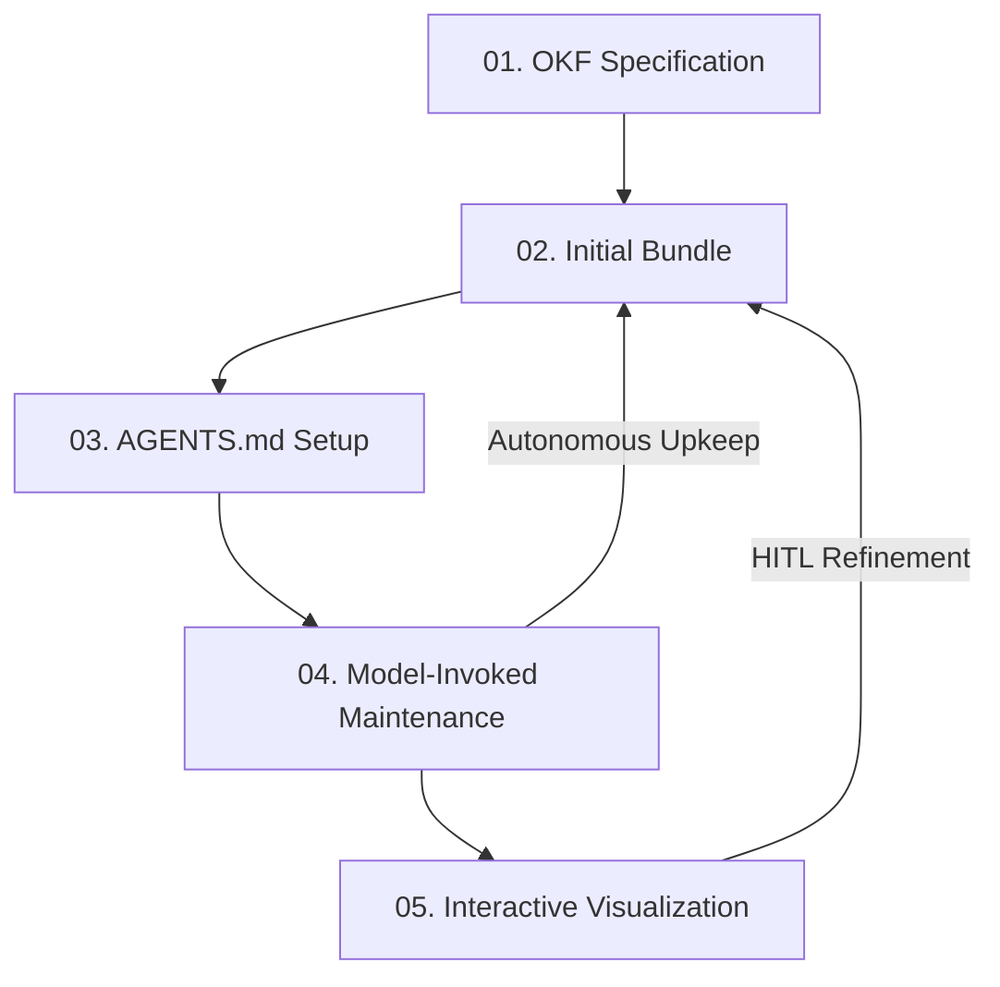

# The Self-Documenting Codebase (OKF Skills)

> **Live Interactive Visualizer & Token Simulator:** [👉 Visit the Interactive OKF Playbook & Simulator](https://eloybar.github.io/okf-skills/)

Integrating Open Knowledge Format (OKF) specifications with LLM skills constructs an adaptable, zero-rot knowledge ecosystem for brownfield and greenfield repositories. 

---

## 🔄 The Knowledge Loop Lifecycle

The self-documenting codebase runs on a closed-loop system of continuous concept mapping, steering, and verification:



### 1. OKF Specification
Establishes typed Markdown concepts to store codebase architecture, core domain models, and solutions.
* **Component**: [okf/SKILL.md](okf/SKILL.md)

### 2. Initial Bundle Creation
Builds the first set of concepts under `./okf` or `./docs/solutions` to document the codebase's architecture and lessons learned.
* **Component**: [okf/SKILL.md](okf/SKILL.md)

### 3. AGENTS.md Steering Notice
Informs incoming LLM agents (like Antigravity or Claude Code) that the repository has a structured knowledge base, providing instructions on how to use it.
* **Component**: `AGENTS.md` (root directory configuration)

### 4. Model-Invoked Maintenance
Automatically runs post-edit checks to verify that modifications to files don't render documentation out of date. **Feeds directly back into Step 2 to complete the Autonomous Upkeep loop.**
* **Component**: [okf-maintain/SKILL.md](okf-maintain/SKILL.md)

### 5. Interactive Visualization
Generates dynamic Cytoscape.js HTML graph visualizations of concepts, dependencies, and connections. **Serves as the entry point for the Human-in-the-Loop (HITL) Refinement loop, allowing developers to visually audit codebase topology and manually calibrate concept alignments.**
* **Component**: [okf-visualize/SKILL.md](okf-visualize/SKILL.md)

---

## ⚡ Why This Approach is Effective

* **Eliminating the "Cold Start":** When a new developer or agent joins a project, they do not need to spend hours manually reading files to construct a mental model.
* **Adaptive Context Scaling:** Rather than providing a raw dump of files, agents ingest only the relevant concept bundles.
* **Zero Documentation Rot:** By hooking into the agent's edit lifecycle, concepts are kept fresh with every commit.

---

## 📥 Installation & Setup

You can install, update, or remove these skills using any of the following methods:

### Method 1: Using the `skills` CLI
If your agent environment supports the `npx skills@latest` tool:

* **Workspace-Specific Installation (Local)**:
  To install the skills only for the current project directory (under `.agents/skills/`):
  ```bash
  npx skills@latest add eloybar/okf-skills
  ```
* **Global Installation (All Workspaces)**:
  Running `npx skills@latest add eloybar/okf-skills --global` will normally fail with a `PromptScript does not support global skill installation` error because the CLI attempts to install PromptScript globally. 
  
  To bypass this and install the skills globally for a specific agent:
  * **For Antigravity / Gemini CLI**:
    ```bash
    npx skills@latest add eloybar/okf-skills --global --agent antigravity
    ```
  * **For Claude Code**:
    ```bash
    npx skills@latest add eloybar/okf-skills --global --agent claude
    ```
* **To Check for Updates / Update / Remove**:
  ```bash
  npx skills@latest check
  npx skills@latest update okf okf-maintain okf-visualize
  npx skills@latest remove okf okf-maintain okf-visualize
  ```

> [!TIP]
> **Node.js Requirement:** The `npx skills@latest` tool requires Node.js v16+ (v18+ or v20+ recommended). If you get an `Unexpected token import` or `ERR_REQUIRE_ESM` error, or if the skills are not getting correctly registered/copied to your agent's config folder, use **Method 2 (Local Script)** instead.

---

### Method 2: Local Script Installer (Recommended for All Agents)
This method copies the skills directly to your global agent paths, making them active globally in any directory on your system. The scripts have been updated to support and default to installing for **all supported agents** (Antigravity, Claude Code, and general agents like Cursor or Cline) simultaneously.

1. **Clone the repository and run the installer**:
   * **Windows (PowerShell)**:
     ```powershell
     git clone https://github.com/eloybar/okf-skills.git; cd okf-skills; .\install.ps1
     ```
   * **macOS / Linux (Bash)**:
     ```bash
     git clone https://github.com/eloybar/okf-skills.git && cd okf-skills && ./install.sh
     ```

2. **Clean up the clone** (Optional — you can safely delete the repository folder afterward):
   * *Windows*: `cd ..; Remove-Item -Path okf-skills -Recurse -Force`
   * *macOS/Linux*: `cd .. && rm -rf okf-skills`

* **To Update**: Navigate to your cloned `okf-skills` folder, pull changes, and run the script again:
  * *Windows*: `git pull; .\install.ps1`
  * *macOS/Linux*: `git pull && ./install.sh`
* **To Remove**: Run the installer with the remove action:
  * *Windows*: `.\install.ps1 -Action Remove`
  * *macOS/Linux*: `./install.sh --action Remove`

> [!NOTE]
> **Common Agent Skills Directories:**
> * **Google Antigravity / Gemini CLI**: `~/.gemini/config/skills`
> * **Claude Code**: `~/.claude/skills`
> * **Cursor / General Agents**: `~/.agents/skills`
> * **Codex**: `~/.codex/skills`

----

## 🚀 Quick Start (OKF in Action)

Once you have installed the skills, here is how you use them in your development workflow:

### Scenario A: Greenfield Project (Bootstrapping New Repositories)
If you are starting a fresh project and want to lay down solid agent-steering guidelines from Day 1:

1. **Launch your agent** in the project directory:
   ```bash
   # Run the startup command for your preferred agent CLI:
   agy      # Google Antigravity
   claude   # Claude Code
   pi       # Pi
   hermes   # Hermes
   codex    # Codex
   ```
2. **Bootstrap the OKF bundle**: Ask the agent to initialize OKF:
   > "initialize OKF" (or run the `/okf` custom command)
3. **What happens**:
   * The agent automatically creates an `okf/` folder at the root.
   * It populates it with standard index and log files.
   * It writes a root-level `AGENTS.md` file directing all future agent sessions to read and maintain the OKF bundle.
   * It begins drafting initial concept files describing the starting code architecture.

---

### Scenario B: Brownfield Project (Maintaining Existing Codebases)
If you have an existing codebase and are making changes (like refactoring a module, adding a database table, or introducing a service):

1. **Work on your task** as usual using the agent:
   > "add a new checkouts database table and API endpoint"
2. **Automated Upkeep (No manual action required)**:
   * Because the root-level `AGENTS.md` directs all future agent sessions to read and maintain the OKF bundle, the agent will **automatically run the upkeep pipeline** (`okf-maintain` skill) as part of finishing its task.
   * The agent scans your codebase modifications, detects that the checkout database structure and API endpoint were added, and automatically generates or updates the concept files (e.g. `okf/tables/checkouts.md`).
   * It automatically updates the global `okf/index.md` index and appends an entry to `okf/log.md`.
   * Your codebase and its agent-navigable documentation remain in perfect, automated sync without you ever having to ask!

----

## 🛠️ Repository Contents

This repository implements the above pipeline via the following custom agent skills:

* **[okf/](okf/)**: Handles creation and structure of Open Knowledge Format (OKF) bundles.
* **[okf-maintain/](okf-maintain/)**: Runs validation after changes to keep concepts updated.
* **[okf-visualize/](okf-visualize/)**: Generates the interactive Cytoscape graphs.
* **[okf_thought_process.html](okf_thought_process.html)**: The original visual brief and token simulator.


---

## 📄 License

This project is licensed under the MIT License - see the [LICENSE](LICENSE) file for details.

