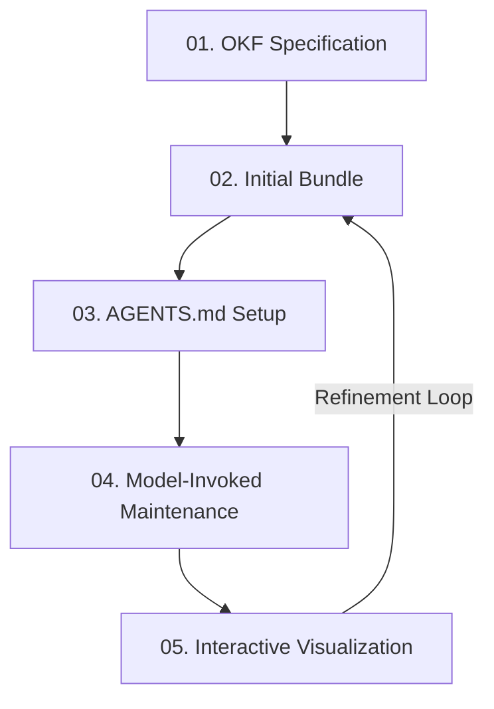

# The Self-Documenting Codebase (OKF Skills)

> **Live Interactive Visualizer & Token Simulator:** [👉 Visit the Interactive OKF Playbook & Simulator](https://eloybar.github.io/okf-skills/)

Integrating Open Knowledge Format (OKF) specifications with LLM skills constructs an adaptable, zero-rot knowledge ecosystem for brownfield and greenfield repositories. 

---

## 🔄 The Knowledge Loop Lifecycle

The self-documenting codebase runs on a closed-loop system of continuous concept mapping, steering, and verification:



### 1. OKF Specification
Establishes typed Markdown concepts to store codebase architecture, core domain models, and solutions.
* **Component**: [okf/SKILL.md](file:///D:/projects/okf-skills/okf/SKILL.md)

### 2. Initial Bundle Creation
Builds the first set of concepts under `./okf` or `./docs/solutions` to document the codebase's architecture and lessons learned.
* **Component**: [okf/SKILL.md](file:///D:/projects/okf-skills/okf/SKILL.md)

### 3. AGENTS.md Steering Notice
Informs incoming LLM agents (like Antigravity or Claude Code) that the repository has a structured knowledge base, providing instructions on how to use it.
* **Component**: `AGENTS.md` (root directory configuration)

### 4. Model-Invoked Maintenance
Automatically runs post-edit checks to verify that modifications to files don't render documentation out of date. 
* **Component**: [okf-maintain/SKILL.md](file:///D:/projects/okf-skills/okf-maintain/SKILL.md)

### 5. Interactive Visualization
Generates dynamic Cytoscape.js HTML graph visualizations of concepts, dependencies, and connections.
* **Component**: [okf-visualize/SKILL.md](file:///D:/projects/okf-skills/okf-visualize/SKILL.md)

---

## ⚡ Why This Approach is Effective

* **Eliminating the "Cold Start":** When a new developer or agent joins a project, they do not need to spend hours manually reading files to construct a mental model.
* **Adaptive Context Scaling:** Rather than providing a raw dump of files, agents ingest only the relevant concept bundles.
* **Zero Documentation Rot:** By hooking into the agent's edit lifecycle, concepts are kept fresh with every commit.

---

## 📥 Installation & Setup

You can install, update, or remove these skills using any of the following methods:

### Method 1: Unified One-liner Installer (Recommended)
This method auto-detects your agent configuration and handles setup, updates, and removal. It works without Node.js dependencies.

* **Windows (PowerShell)**:
  * **To Install / Update**:
    ```powershell
    Set-ExecutionPolicy Bypass -Scope Process -Force; [System.Net.ServicePointManager]::SecurityProtocol = [System.Net.SecurityProtocolType]::Tls12; iex ((New-Object System.Net.WebClient).DownloadString('https://raw.githubusercontent.com/eloybar/okf-skills/main/install.ps1'))
    ```
  * **To Remove**:
    ```powershell
    Set-ExecutionPolicy Bypass -Scope Process -Force; [System.Net.ServicePointManager]::SecurityProtocol = [System.Net.SecurityProtocolType]::Tls12; iex ((New-Object System.Net.WebClient).DownloadString('https://raw.githubusercontent.com/eloybar/okf-skills/main/install.ps1')) -Action Remove
    ```

* **macOS / Linux (Bash)**:
  * **To Install / Update**:
    ```bash
    curl -fsSL https://raw.githubusercontent.com/eloybar/okf-skills/main/install.sh | bash
    ```
  * **To Remove**:
    ```bash
    curl -fsSL https://raw.githubusercontent.com/eloybar/okf-skills/main/install.sh | bash -s -- --action Remove
    ```

---

### Method 2: Using the `skills` CLI
If your agent environment supports the `npx skills` tool:

* **To Install / Update**:
  ```bash
  npx skills add eloybar/okf-skills
  ```
* **To Check for Updates**:
  ```bash
  npx skills check
  ```
* **To Update Specific Skills**:
  ```bash
  npx skills update okf okf-maintain okf-visualize
  ```
* **To Remove**:
  ```bash
  npx skills remove okf okf-maintain okf-visualize
  ```

> [!TIP]
> **Node.js Requirement:** The `npx skills` tool requires Node.js v16+ (v18+ or v20+ recommended). If you get an `Unexpected token import` or `ERR_REQUIRE_ESM` error, either upgrade Node.js or use **Method 1** above (which bypasses Node.js entirely).

> [!IMPORTANT]
> **CLI Global Limitation:** The `skills` CLI does not support installing markdown/PromptScript skills globally; running it with `-g` or `--global` will fail with a `PromptScript does not support global skill installation` error.
> 
> If you want to use these skills **globally** across all projects (working in any directory), you must use **Method 1 (One-liner)** or **Method 3 (Manual)** instead, which install them directly to your agent's global configuration path.

---

### Method 3: Manual Installation (Git & Copy)
If you prefer manual control:

1. **Define your agent's skills directory** (see paths in the Note below).
   * *Windows*: `$AgentSkillsDir = "$HOME\.gemini\config\skills"`
   * *macOS/Linux*: `AGENT_SKILLS_DIR="$HOME/.gemini/config/skills"`
2. **Clone & Copy (Install / Update)**:
   * *Windows (PowerShell)*:
     ```powershell
     git clone https://github.com/eloybar/okf-skills.git
     New-Item -ItemType Directory -Force -Path $AgentSkillsDir
     Copy-Item -Path "okf-skills\okf", "okf-skills\okf-maintain", "okf-skills\okf-visualize" -Destination "$AgentSkillsDir\" -Recurse -Force
     Remove-Item -Path "okf-skills" -Recurse -Force
     ```
   * *macOS / Linux (Bash)*:
     ```bash
     git clone https://github.com/eloybar/okf-skills.git
     mkdir -p "$AGENT_SKILLS_DIR"
     cp -r okf-skills/okf okf-skills/okf-maintain okf-skills/okf-visualize "$AGENT_SKILLS_DIR/"
     rm -rf okf-skills
     ```
3. **Removal**:
   * *Windows (PowerShell)*:
     ```powershell
     Remove-Item -Path "$AgentSkillsDir\okf", "$AgentSkillsDir\okf-maintain", "$AgentSkillsDir\okf-visualize" -Recurse -Force
     ```
   * *macOS / Linux (Bash)*:
     ```bash
     rm -rf "$AGENT_SKILLS_DIR/okf" "$AGENT_SKILLS_DIR/okf-maintain" "$AGENT_SKILLS_DIR/okf-visualize"
     ```

> [!NOTE]
> **Common Agent Skills Directories:**
> * **Google Antigravity / Gemini CLI**: `~/.gemini/config/skills`
> * **Claude Code**: `~/.claude/skills`
> * **Hermes**: `~/.hermes/skills`
> * **Codex**: `~/.codex/skills`


---

## 🛠️ Repository Contents

This repository implements the above pipeline via the following custom agent skills:

* **[okf/](file:///D:/projects/okf-skills/okf/)**: Handles creation and structure of Open Knowledge Format (OKF) bundles.
* **[okf-maintain/](file:///D:/projects/okf-skills/okf-maintain/)**: Runs validation after changes to keep concepts updated.
* **[okf-visualize/](file:///D:/projects/okf-skills/okf-visualize/)**: Generates the interactive Cytoscape graphs.
* **[okf_thought_process.html](file:///D:/projects/okf-skills/okf_thought_process.html)**: The original visual brief and token simulator.


---

## 📄 License

This project is licensed under the MIT License - see the [LICENSE](file:///D:/projects/okf-skills/LICENSE) file for details.

