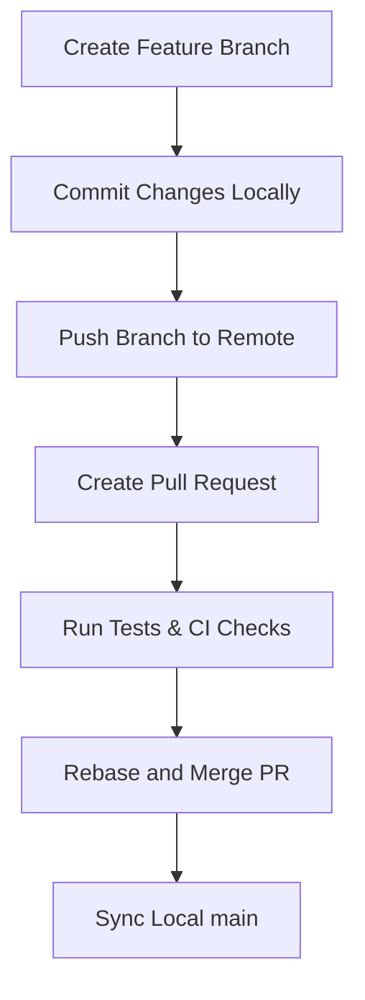

# Git Development and Pull Request Workflow

## 1. Overview
To ensure code quality, keep a clean, flat linear history on `main`, and run automated tests before merges, all code changes must follow a strict branching and Pull Request (PR) workflow. 

**Direct pushes to `main` are prohibited for standard feature development.**

### 1.1 Pull Request Sizing & Commit Grouping
A Pull Request (PR) represents a cohesive, testable **logical unit of work** (e.g., a feature, a bug fix, or a documentation block), rather than a single commit. 

* **Group Commits by Logical Task:** When implementing a feature, commit incrementally locally for work in progress (e.g., adding logic, adding tests, updating docs), but push and open a **single PR** containing all these related commits. This allows reviews to happen holistically on the completed feature.
* **Avoid Micro-PRs:** Creating a PR for every single individual commit is discouraged as it causes CI/CD queue congestion and review fatigue.
* **Single-Commit PRs:** These are reserved exclusively for simple standalone actions, such as quick documentation copy edits or minor configuration patches.

---

## 2. Step-by-Step Workflow



### Step 1: Create a Feature Branch
Always create a clean, descriptive branch off of the latest `main`:
```bash
git checkout main
git pull --ff-only
git checkout -b feat/your-feature-name
```
Branch naming conventions:
- `feat/*` for new capabilities or user-facing enhancements
- `fix/*` for bug fixes and patches
- `docs/*` for documentation or knowledge bundle updates
- `perf/*` for performance improvements

### Step 2: Commit Changes
Commit changes incrementally with clear, value-communicating commit messages following conventional commits format:
```bash
git add .
git commit -m "feat(scope): brief description of feature"
```

### Step 3: Run Verification
Before pushing, run the project's test suite and lint checks to ensure no regressions (see [OKF Lint Skill](/concepts/okf-lint-skill.md)):
```bash
node okf-lint/scripts/lint.js --drift  # OKF conformance & drift check
node scripts/test-lifecycle.js        # Integration lifecycle test suite
```

### Step 4: Push to Remote
Push the branch to origin to set up tracking:
```bash
git push -u origin HEAD
```

### Step 5: Create a Pull Request (PR)
Create a PR using the GitHub CLI (`gh`) or the GitHub Web interface:
```bash
gh pr create --title "feat(scope): your feature title" --body "Adaptive description of changes."
```

### Step 6: Rebase and Merge
Once reviews and CI gates pass, merge the PR using the **rebase and merge** strategy to maintain a flat linear history:
```bash
gh pr merge --rebase --delete-branch
```

### Step 7: Synchronize Local main
Update your local `main` and clean up local feature branches:
```bash
git checkout main
git pull --ff-only
```

---

## 3. Mandate for AI Coding Agents

To preserve the repository's audit trail, maintain code-review validation, and respect branch protection configurations:
1. **Commit changes locally** on a dedicated feature branch.
2. **Push the branch to remote** and **create a Pull Request (PR)**.
3. **Rebase and merge** the PR and **delete the feature branch** (both remote and local) once fully merged.

AI agents are prohibited from pushing directly to `main` for standard feature implementations or documentation catalog modifications, unless explicitly authorized or requested by the user.
